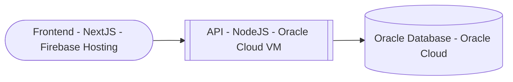

# Gestión de Ventas – Frontend

Interfaz web desarrollada en **Next.js + TypeScript**, conectada a una API Node.js desplegada en **Oracle Cloud**.  
Permite visualizar datos de ventas, vendedores, clientes y reportes generados por la base de datos **Oracle PL/SQL**.  
---

## Demo en línea

**Frontend activo:** [oracle-dashboard.0003333.xyz](https://oracle-dashboard.0003333.xyz)  
**API conectada:** [api.0003333.xyz](https://api.0003333.xyz)

> El frontend está alojado en **Firebase Hosting** y consume datos en tiempo real desde el backend desplegado en una **VM de Oracle Cloud**.

---

## Repositorios Relacionados

- [Backend (Node.js + Oracle Cloud)](https://github.com/alex3373/Oracle_Gestion_API)
- [Base de datos PL/SQL](https://github.com/alex3373/BBDD_SQL-PLSQL)

---

## Tecnologías Utilizadas

| Capa | Tecnología |
|------|-------------|
| Framework | Next.js (App Router) |
| Lenguaje | TypeScript |
| Estilos | Tailwind CSS |
| Animaciones | Framer Motion |
| Despliegue | Firebase Hosting |
| Integración | Fetch API hacia backend REST (Oracle Cloud) |

---

## Arquitectura General

---

## Autor

**Alexis Córdova Díaz**  
Analista Programador | Desarrollador Full Stack  
📧 alexisandres311@gmail.com  
🌐 [linkedin.com/in/alexis-andres-cordova](https://linkedin.com/in/alexis-andres-cordova)

---
